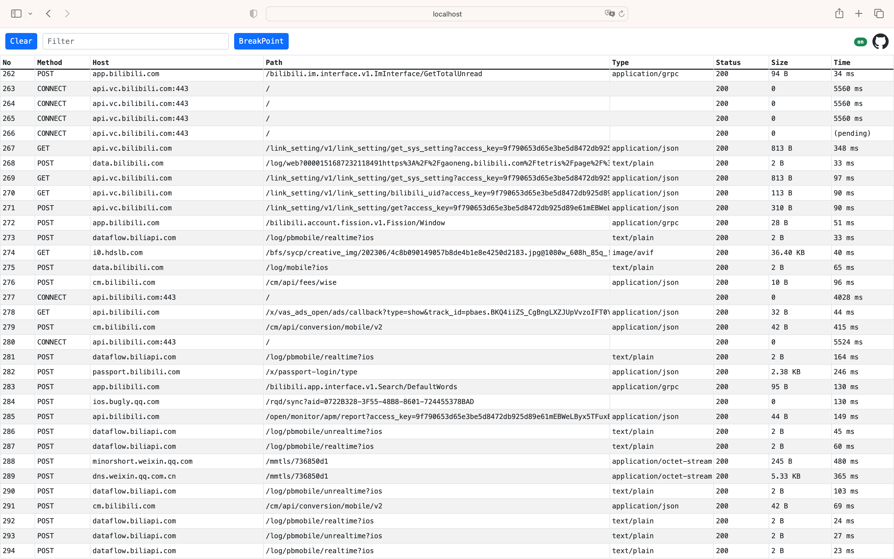
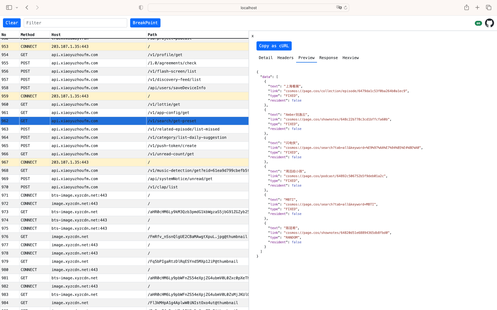

# go-mitmproxy

[mitmproxy](https://mitmproxy.org/) implemented with golang.

用 Golang 实现的中间人攻击（[Man-in-the-middle](https://en.wikipedia.org/wiki/Man-in-the-middle_attack)），解析、监测、篡改 HTTP/HTTPS 流量。

## 特点

- HTTPS 证书相关逻辑参考 [mitmproxy](https://mitmproxy.org/) 且与之兼容，根证书也保存在 `~/.mitmproxy` 文件夹中，如果之前用过 `mitmproxy` 且根证书已经安装信任，则此 `go-mitmproxy` 可以直接使用
- 支持插件机制，很方便扩展自己需要的功能，可参考 [addon/addon.go](./addon/addon.go)
- 性能优势
    - Golang 天生的性能优势
    - 在进程内存中转发解析 HTTPS 流量，不需通过 tcp端口 或 unix socket 等进程间通信
    - 生成不同域名证书时使用 LRU 缓存，避免重复计算
- 通过环境变量 `SSLKEYLOGFILE` 支持 `Wireshark` 解析分析流量
- 上传/下载大文件时支持流式传输
- Web 界面

## 安装

```
GO111MODULE=on go get -u github.com/lqqyt2423/go-mitmproxy/cmd/go-mitmproxy
```

## 命令行使用

### 启动

```
go-mitmproxy
```

启动后，HTTP 代理地址默认为 9080 端口，Web 界面默认在 9081 端口。

首次启动后需按照证书以解析 HTTPS 流量，证书会在首次启动命令后自动生成，路径为 `~/.mitmproxy/mitmproxy-ca-cert.pem`。可参考此链接安装：[About Certificates](https://docs.mitmproxy.org/stable/concepts-certificates/)。

### 自定义参数

```
go-mitmproxy --help

Usage of go-mitmproxy:
  -addr string
    	proxy listen addr (default ":9080")
  -dump string
    	dump filename
  -dump_level int
    	dump level: 0 - header, 1 - header + body
  -web_addr string
    	web interface listen addr (default ":9081")
```

## 作为包引入

参考 [cmd/go-mitmproxy/main.go](./cmd/go-mitmproxy/main.go)，可通过自己实现 `AddAddon` 方法添加自己实现的插件。

## Web 界面






## TODO

- [ ] http2
- [ ] websocket 解析

## License

[MIT License](./LICENSE)
